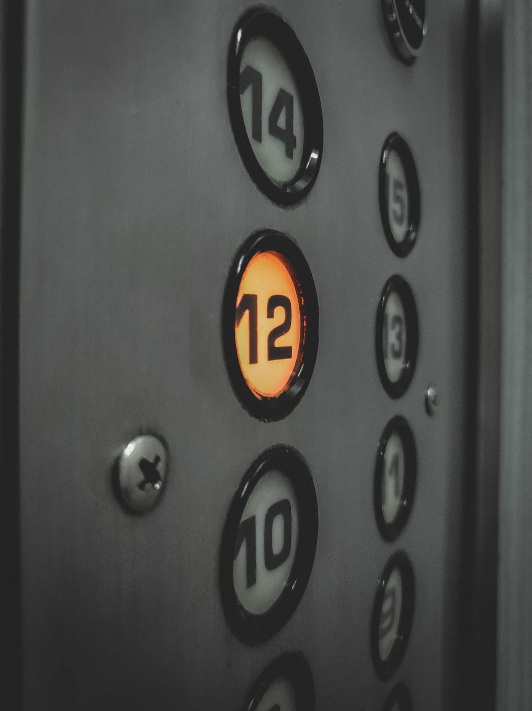
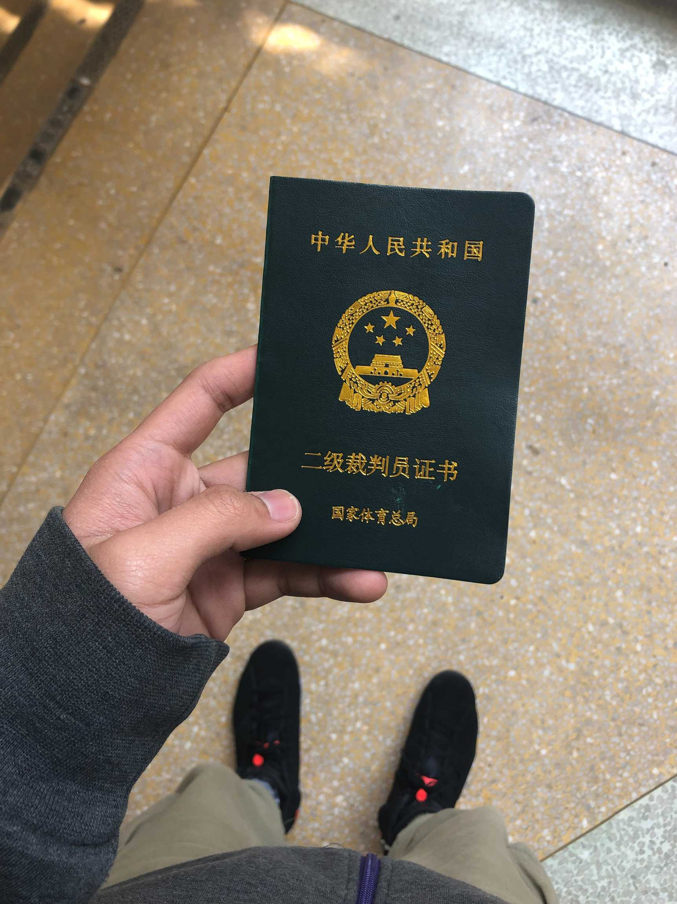

# Woland Design
## Storage is all you need

---

## Elevator Pitch

Woland stores data on the cloud without losing control of it. 
Data is E2E encrypted and easy to move. 
Access is granted only to owners.

---

## Identity
An identity uniquely identifies a user

An identity is made of:
- a private key, accessible only to the identity owner
- a public key, shared with other peer
- human friendly 

The key support EC asymmetric encryption and digital signature.

---

## Group
A group is a set of identities. 

At a specific time identities in a group share an encryption key, which allows to decrypt data on a public storage.

---

## Pod
A pod is an encrypted container for a piece of data. A Pod comes with:

- key id, so to identify the related decryption key
- snowflake id
- modification time
- a beloging group 
- full name, including folders
- size, for corruption control
- content type
- optional thumbail
- optional compression

---
## Keys

---

## Safe
A safe is encrypted data on storage, which is easily accessible. It includes:

- users, described by their identities
- groups, collection of users
- pods, encrypted content
- keys, use to encrypt data

---

