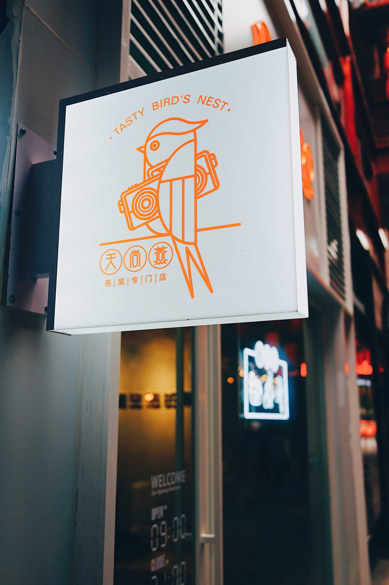

# Woland Design
## Storage is all you need

---

## Elevator Pitch

Woland stores data on the cloud without losing control of it. 
Data is E2E encrypted and easy to move. 
Access is granted only to owners.

---

## Identity
An identity uniquely identifies a user

An identity is made of:
- a private key, accessible only to the identity owner
- a public key, shared with other peer
- human friendly 

The key support EC asymmetric encryption and digital signature.

---


## ID
An id is a 64 bits identifier made

|Reserved|Timestamp|Hash|Seq|
|-|-|-|-|
|1 bit|41 bits|16 bits|6 bits|

Timestamp in ms since the Epoch, and hash is sha1 of another 64 bit identifier

---


## Store

A store is an abstraction of storage services, such as S3 or SFTP. It provides functions to list the content, read and write it.
```
ReadDir(store, name, filter)
Read(store, name, range, dest, progress) 
Write(store, name, source, progress)
Stat(store, name)
Delete(store, name) error
```

---


## Safe
A safe is a remote location where data is securily stored. 

A safe is accessible via an access token, defined by a name, an AES encryption key and one or more URLs, each pointing to a store. The information is encoded with the private key of an identity

## Zone
A zone is part of a safe that is accessible to a list of users. 
Each zone has one or more encryption key.
Each zone has at least one admin (usually the creator).

Only admins can add ore remove users from a zone; the authority is based on trust, meaning that a change is accepted only when signed by an admin.

Only admins can create an access token.

---
## API

```
Open(token, options)
Close(safe)
Share(token, from, to)

ListZones(safe, mine)
AddUsers(safe, zone, users)
RemoveUser(safe, zone, time, users)
ListUsers(safe, zone)

List(safe, zone, filter)
Put(safe, zone, name, source, options) 
Get(safe, zone, name, dest, options)
Delete(safe, zone, name) error

```

---
## Safe Layout
```bash
└── ch.woland.playground
    ├── users
    │   ├── 07_fP9TM0ZJ5eKAeXsL_6sip6kzqHXU+FgxXIMW5TkQCzzO8OlbSCkNwVcjclF9lP_DencwL9NizttCJ_wkUFOg=
    │   │   ├── 19291084093332.msg
    │   │   ├── .user
    │   │   └── .touch
    │   └── 7lNLxumA_2sJ9OGIPOW_TCL9ZVauPYzMhGs6XhtKqPsCr9lwx4c8bhZllD1J0g3A+JR3jvJc7ltNCQ0oNbH_MGc=
    │       ├── .identity
    │       └── .touch
    └── zones
        └── main
            ├── 1242261766998016.zone
            ├── 29457761766998016.body
            ├── 29457761766998016.head
            └── .touch

```

---
## Layout elemens
 
- .touch files are modified every time 
- .user contains user information
- msg files are user specific messages
- users folder contain a subfolder for each usr
- zones folder contain a subfolder for each zone
- head files contain the header of a file
- body files contain the body of a file

---
## Keys

Three different encryption keys:
1. optionally each safe has a AES key (part of access token) to encrypt names on the store
2. each zone has a AES key to encrypt headers
3. each header has a AES key to encrypt the body

The second key is encrypted with the private key of each user and kept in the group information

---

## Zone file

A zone file contains update about users belonging to the zone and key information

```yaml
users:
    7lNLxumA_2sJ9OGIPOW_TCL9ZVauPYzMhGs6XhtKqPsCr9lwx4c8bhZllD1J0g3A+JR3jvJc7ltNCQ0oNbH_MGc=:
        masterKey: 99j9w9dj9dj9JJ*H*2552728
        expires: 2032-06-06T00:00:00+02:00
        modTime: 2020-06-06T00:00:00+02:00  
permissionTrail:
    - user: 0322xumA_2sJ9OGIPOW_TCL9ZVauPYzMhGs6XhtKqPsCr9lwx4c8bhZllD1J0g3A+JR3jvJc7ltNCQ0oNbH_MGc=:
      permission: 3
      modTime: 2020-06-06T00:00:00+02:00  
      by: 7lNLxumA_2sJ9OGIPOW_TCL9ZVauPYzMhGs6XhtKqPsCr9lwx4c8bhZllD1J0g3A+JR3jvJc7ltNCQ0oNbH_MGc=
      ssignature: 99j9w9dj9dj9JJ*H*2552728
signature:
    7lNLxumA_2sJ9OGIPOW_TCL9ZVauPYzMhGs6XhtKqPsCr9lwx4c8bhZllD1J0g3A+JR3jvJc7ltNCQ0oNbH_MGc=: 99j9w9dj9dj9JJ*H*2552728
```

---


